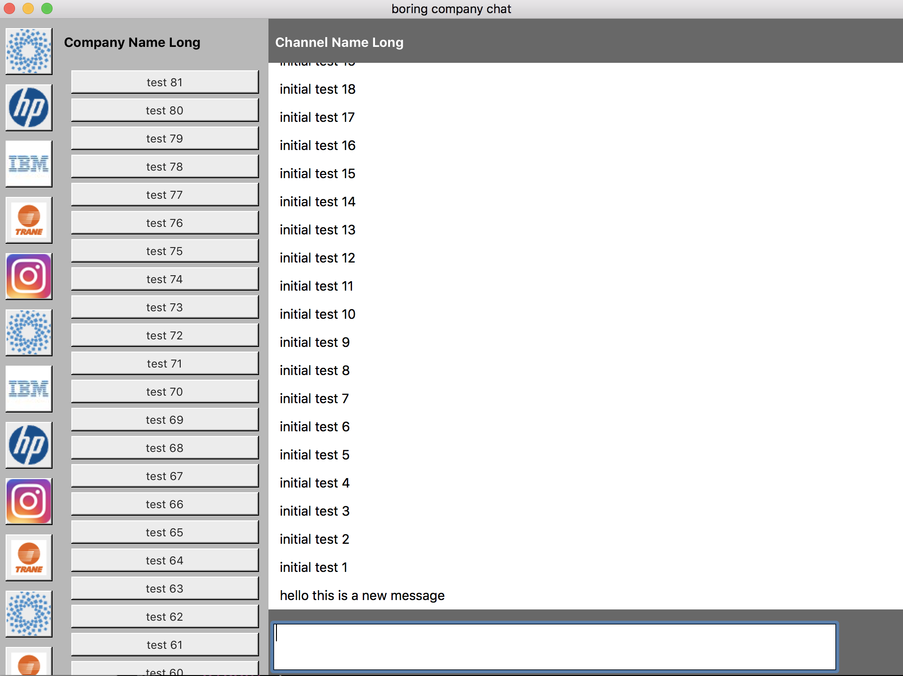

# boring company chat

a macOS native AppKit cocoa swift3 chat app.

The idea came from https://josephg.com/blog/electron-is-flash-for-the-desktop/

it uses [Moya/RxSwift](https://github.com/Moya/Moya) (Network abstraction layer)

[Hearst-DD/ObjectMapper](https://github.com/Hearst-DD/ObjectMapper) (Simple JSON Object mapping)

[daltoniam/Starscream](https://github.com/daltoniam/Starscream) (Websockets)

[Alamofire and AlamofireImage](https://github.com/Alamofire/Alamofireimage) (Elegant HTTP Networking)

[realm-cocoa](https://github.com/realm/realm-cocoa) (database replacement for Core Data/SQLite)

# useful links

* https://josephg.com/blog/electron-is-flash-for-the-desktop/
* https://slack.com
* https://about.mattermost.com
* https://rocket.chat
* https://ryver.com
* https://www.bitrix24.com
* http://moxtra.com
* https://fleep.io

# plans

So I want to build an "open source slack replacement" with the following goals:

* Native macOS client first, in swift, with good memory 
* NO WebKit or HTML parsing code, all messages are displayed as text with some cocoa font formating
* Images can be displayed inline, but this will NOT be a mini chrome running.
* Links can be hot, but they will open default browser on the mac
* Offers peer-to-peer no server solution for small teams that can handle that
* Offers slack style company owns the data no peer to peer needed

# building

* sudo gem install cocoapods
* pod install
* then open `boring-company-chat.xcworkspace` not the project
* run from xcode

# data on your hard drive is stored at:

* ~/Library/Preferences/higher.team.chat4work.plist 
* "~/Library/Application Support/higher.team.chat4work/default.realm.management"
